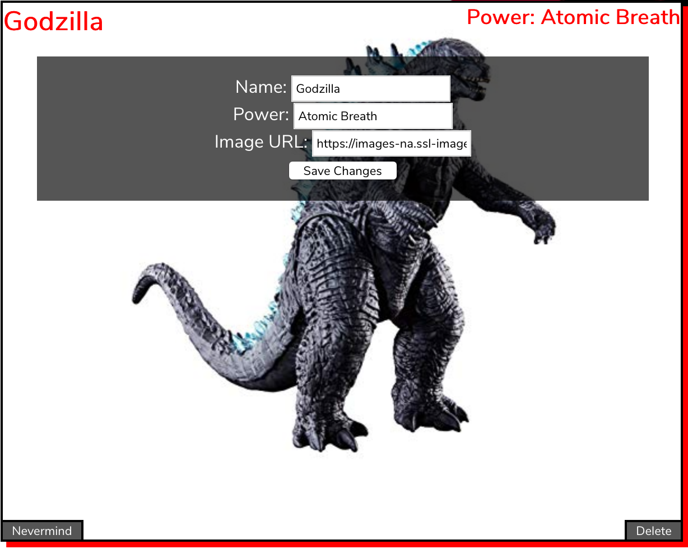

# Kaiju Tracker


### Prep 

Questions / Pain Points
- edit form... how to pass down state to another form and make it controlled... also handling multiple forms


### React Edition


The UN has tasked you with building a website to better help them track Kaiju across the world! Your job is to make an app that allows anyone to look at, add, edit, or delete a Kaiju. In addition, they've given you some code for a news ticker that shows in realtime what the Kaiju are doing.

## Gettings Started

In the terminal, start the app with `npm start`. Additionally, in a separate terminal you'll need to begin the local json server with `npm run server`.

`npm run server` *is a custom script. If you have questions about what it's doing or you want to build your own, you can check it out in* `package.json`.

## Fetch Requests

It's suggested you store all your fetch requests in `requests.js`. The first request has already been built out for you. You don't have to build out all your requests using the variables provided or even using the file provided, however this is one way you can keep your code `DRY`.

In order to import your fetches, include this line with the other imports at the top of a react file: `import * as requests from './requests'`

To use any of the requests, call `requests.requestNameHere()`. This will return a promise you can then utilize and chain `.then` methods off of. As an example:

```
requests.fetchKaijus()
.then(response => console.log(response))
```

A typical Kaiju object returned looks like this:

```
{
  id: 1,
  name: "Godzilla",
  power: "Atomic Breath",
  image: "https://images-na.ssl-images-amazon.com/images/I/71Q1ckgmeQL._SX425_.jpg"
}
```

## Kaiju Cards


Once the Kaiju have been fetched, load them into the Kaiju container element. An example card:

```
<div className='kaiju-card'>

  <h2 className='kaiju-card-name'>Kaiju name goes here</h2>
  <h3 className='kaiju-card-power'>Power: Kaiju power goes here</h3>

  

  <button className='kaiju-card-edit-button'>Edit Kaiju</button>

</div>
```

## Adding Kaiju

A form has already been provided for adding new Kaiju. Make sure that this is a `controlled form`. When thinking about how to do this, consider these things: should the Kaiju be added optimistically or pessimistically? Where does the Kaiju need to be updated? How can this be done without mutating state?

**BONUS: Render the create form conditionally (user must click a button to see the form).**

## Editing and Deleting Kaiju



The edit button on the card, once clicked, should show a form within the Kaiju card with the class of `kaiju-card-edit-form`. This should be rendered conditionally. When thinking about conditional rendering, can you leverage state in some way to decide whether it should be shown?

Similar to adding a Kaiju, both the front and back end should reflect the edited Kaiju once that Kaiju has been submitted. The same goes for the delete button (which you should add yourself!).

**BONUS: The delete button only renders when the edit form is open**

## Sightings

This next bit is deliberately vague because it's up to you to decide how it'll work and look like!

Once you have Kaiju working, it's time to list out sightings for them! Each sighting is linked to a Kaiju through their id, however because we're not working with a relational database, you'll have to find a Kaiju's sightings and vice versa manually.

As with the endpoint for Kaijus, there's also an endpoint listed in `requests` for sightings. Building out requests will work similarly.

A typical sighting will look like this:

```
{
  "id": 1,
  "kaijuId": 1,
  "location": "Tokyo",
  "description": "Oh no! There goes Tokyo! Go go Godzilla!"
}
```

Create an additional component on each Kaiju card that displays each of the monster's sightings i.e. each sighting's description and location.

## Adding Sightings

Once this is working you'll notice there aren't a lot of sightings. So the next step is to add a form that allows us to add more sightings!

You can place this form wherever you want, but we need to make sure each sighting is linked to a specific Kaiju. Keep this in mind when building out the form. As with the above form, this should be a controlled form and update both the database and the Kaiju that sighting belongs to.


Sightings can be added directly to the Kaiju card or you can build your own cards.

**BONUS: Sightings conditionally renders on the click of a sightings button or as the back of a card.**

**BONUS: Each Kaiju displays the number of sightings attributed to them.**

**Hints:**

***Which things need state in order to work?***

***You can query the json-server with parameters: ex. 'localhost:4000/kaiju?id=1'***

***More than one component can have state! Use this to your advantage!***
